# CLAUDE.md

This file provides guidance to Claude Code (claude.ai/code) when working with code in this repository.

## Common Development Commands

### Testing
```bash
# Run all tests with coverage
python -m pytest --cov=apps --cov-report=html:coverage_reports/html --tb=short -v

# Run specific test categories
python -m pytest -m unit          # Unit tests only
python -m pytest -m integration   # Integration tests only
python -m pytest -m security      # Security tests only

# Run race condition tests (critical for data integrity)
python -m pytest apps/core/tests/test_background_task_race_conditions.py -v
python -m pytest apps/y_helpdesk/tests/test_ticket_escalation_race_conditions.py -v
python -m pytest apps/core/tests/test_atomic_json_field_updates.py -v
python -m pytest apps/activity/tests/test_job_race_conditions.py -v
python -m pytest apps/attendance/tests/test_race_conditions.py -v

# Run all race condition tests together
python -m pytest -k "race" -v

# Penetration tests for race conditions
python comprehensive_race_condition_penetration_test.py --scenario all
python comprehensive_race_condition_penetration_test.py --scenario autoclose

# Run working test suite (pre-configured subset)
./run_working_tests.sh

# Single test file
python -m pytest apps/peoples/tests/test_models/test_people_model_comprehensive.py -v

# Stream Testbench specific tests
python -m pytest apps/streamlab/tests/ apps/issue_tracker/tests/ -v
python run_stream_tests.py                    # Complete Stream Testbench test suite
python testing/stream_load_testing/spike_test.py  # Quick performance validation
```

### Development Server
```bash
# Start development server (HTTP only)
python manage.py runserver

# Start ASGI server for WebSocket support (recommended for Stream Testbench)
daphne -b 0.0.0.0 -p 8000 intelliwiz_config.asgi:application

# With specific settings
DJANGO_SETTINGS_MODULE=intelliwiz_config.settings_test python manage.py runserver
```

### Database Management
```bash
# Create and apply migrations
python manage.py makemigrations
python manage.py migrate

# Initialize application with default data
python manage.py init_intelliwiz default

# Database shell with enhanced features
python manage.py shell_plus --print-sql
```

### Static Files and Assets
```bash
# Collect static files for production
python manage.py collectstatic --no-input

# Generate model graphs (requires django-extensions)
python manage.py graph_models --all-applications --group-models -o models.png
```

## High-Level Architecture

This is an **enterprise facility management platform** built with Django 5.2.1, designed for multi-tenant environments with advanced security and performance optimizations.

### Core Business Domains
- **Operations**: Task management, scheduling, work orders, PPM (Planned Preventive Maintenance)
- **Assets**: Inventory management, maintenance tracking, location monitoring
- **People**: User management, attendance tracking, directory services, expense management
- **Help Desk**: Ticket management, escalations, service requests
- **Reports**: Comprehensive analytics and reporting across all domains

### Technical Architecture

#### Database Strategy
- **PostgreSQL 14.2+ with PostGIS** as the primary database
- **Multi-tenant support** with tenant-aware models (`TenantAwareModel`)
- **PostgreSQL-first approach**: Replaced Celery with custom PostgreSQL task queue system
- **Session optimization**: Pure PostgreSQL sessions instead of Redis (20ms trade-off approved)
- **Materialized views**: Custom Select2 cache implementation for performance

#### API Design
- **Dual API approach**: GraphQL (primary) with REST fallback
- **GraphQL endpoint**: `/api/graphql/` with file upload support (`FileUploadGraphQLView`)
- **REST API**: `/api/v1/` for legacy compatibility
- **API security**: Custom API key management with HMAC signing support

#### URL Architecture
The application uses an **optimized domain-driven URL structure** defined in `intelliwiz_config/urls_optimized.py`:

```
/operations/     # Tasks, tours, work orders
/assets/         # Inventory, maintenance, monitoring
/people/         # Directory, attendance, groups
/help-desk/      # Tickets, escalations, requests
/reports/        # All reporting functionality
/admin/          # Administrative functions
```

Legacy URLs are maintained for backward compatibility but redirect to the new structure.

#### Security Framework
- **Multi-layer security middleware**:
  - `SQLInjectionProtectionMiddleware` - SQL injection prevention
  - `XSSProtectionMiddleware` - Cross-site scripting protection
  - `CorrelationIDMiddleware` - Request tracking
- **Content Security Policy (CSP)** with violation reporting (`CSPViolation` model)
- **API authentication** with secure key management (`APIKey`, `APIAccessLog` models)
- **Rate limiting** on authentication and API endpoints
- **Environment-driven security settings** for development vs production

### Custom User Model
Uses `peoples.People` as the custom user model with refactored architecture (compliant with Rule #7):

**Model Split (Sep 2025 - Reducing Complexity):**
- **People** (178 lines): Core authentication and identity
  - Authentication: loginid, password, is_staff, is_superuser
  - Identity: uuid, peoplecode, peoplename
  - Security: email, mobno (encrypted), isadmin, isverified, enable
  - Capabilities: JSON field for AI and system capabilities

- **PeopleProfile** (117 lines): Personal and profile information
  - Profile image, gender, dates (birth, join, report)
  - Legacy capabilities JSON (people_extras)

- **PeopleOrganizational** (177 lines): Organizational relationships
  - Location, department, designation, peopletype, worktype
  - Client, business unit, reporting manager

**Key Features:**
- 100% backward compatibility via property accessors (`PeopleCompatibilityMixin`)
- Query optimization helpers: `with_profile()`, `with_organizational()`, `with_full_details()`
- Automatic signal-based creation of related models
- Multi-tenant support with business unit association
- Email verification workflow with custom callbacks

### Caching Strategy
```python
# Redis for general caching
CACHES['default'] = "redis://127.0.0.1:6379/1"

# Custom materialized view cache for Select2 dropdowns
CACHES['select2'] = MaterializedViewSelect2Cache
```

### Background Processing
Migrated from Celery to **PostgreSQL Task Queue** system:
- Queue configuration: `default`, `high_priority`, `email`, `reports`, `mqtt`, `maintenance`
- Worker concurrency: 4 workers with heartbeat monitoring
- Task retry mechanism with exponential backoff

## Application Structure

### Core Apps
- **`core/`**: Base functionality, security middleware, utilities, health checks
- **`peoples/`**: Authentication, user management, custom user model
- **`tenants/`**: Multi-tenancy support, database routing

### Business Domain Apps
- **`activity/`**: Task and activity management
- **`attendance/`**: Employee attendance tracking
- **`schedhuler/`**: Scheduling and calendar management
- **`work_order_management/`**: Work order lifecycle
- **`y_helpdesk/`**: Help desk and ticketing system
- **`reports/`**: Analytics and reporting engine

### Integration Apps
- **`mqtt/`**: IoT device communication
- **`face_recognition/`**: Biometric authentication
- **`monitoring/`**: System health and performance tracking

### Stream Testing Apps
- **`streamlab/`**: Stream Testbench core - real-time stream testing with PII protection
- **`issue_tracker/`**: Issue Knowledge Base - AI-powered anomaly detection and fix suggestions

### Configuration Notes
- **Settings**: Environment-driven with `.env.dev.secure` for development
- **Database**: Uses `TenantDbRouter` for multi-tenant data isolation
- **Logging**: Comprehensive file-based logging with rotation
- **Static files**: WhiteNoise for development, Nginx for production
- **CORS**: Configured for cross-origin requests with secure defaults

## Key Files to Understand

- `intelliwiz_config/settings.py` - Main configuration with security settings
- `intelliwiz_config/urls_optimized.py` - Optimized URL routing structure
- `apps/peoples/models.py` - Custom user model and authentication
- `apps/core/models.py` - Security models (CSP, API keys) and base utilities
- `apps/tenants/models.py` - Multi-tenancy base classes
- `pytest.ini` - Test configuration with markers and database optimization

## Development Workflow

1. **Environment Setup**: Ensure PostgreSQL with PostGIS is installed
2. **Virtual Environment**: Use Python 3.10+ with requirements from `requirements/base.txt`
3. **Database**: Initialize with `python manage.py init_intelliwiz default`
4. **Testing**: Run `python -m pytest` before committing changes
5. **Security**: All new code should use the security middleware and follow CSP guidelines

## Performance Considerations

- **Database queries**: Use `select_related()` and `prefetch_related()` for complex relationships
- **Caching**: Leverage the materialized view cache for Select2 dropdowns
- **Sessions**: PostgreSQL sessions are optimized for this application's usage pattern
- **Static files**: Use `collectstatic` for production deployments

This architecture supports enterprise-scale operations with robust security, multi-tenancy, and performance optimizations built specifically for facility management workflows.

# 🚨 CRITICAL: CODE QUALITY AND SECURITY ENFORCEMENT

## ⛔ MANDATORY RULE COMPLIANCE - READ BEFORE ANY CODE CHANGES

**🔥 CRITICAL: ALL code changes must strictly follow `.claude/rules.md` - NO EXCEPTIONS**

### 📋 PRE-CODE-CHANGE CHECKLIST
Before making ANY code modifications, Claude Code MUST:

1. **📖 READ `.claude/rules.md`** - Review all forbidden patterns and required implementations
2. **🔍 IDENTIFY applicable rules** - Determine which rules apply to the planned changes
3. **✅ VALIDATE compliance** - Ensure proposed code follows required patterns
4. **🚫 REJECT violations** - Refuse to implement code that violates any rule

### 🔒 ZERO-TOLERANCE SECURITY RULES

**These patterns WILL cause security vulnerabilities - they are FORBIDDEN:**

❌ **GraphQL security bypass** - SQL injection middleware skipping GraphQL endpoints
❌ **Generic exception handling** - `except Exception:` patterns hide real errors
❌ **Custom encryption** - without security team audit and approval
❌ **CSRF exemptions** - `@csrf_exempt` without documented alternative protection
❌ **Debug information exposure** - stack traces or internal details in responses
❌ **Unvalidated secrets** - loading environment secrets without validation
❌ **File upload vulnerabilities** - filename injection and path traversal risks
❌ **Sensitive data logging** - passwords, tokens, or PII in log files

### 📐 ARCHITECTURE COMPLIANCE REQUIREMENTS

**These limits prevent code quality degradation - they are MANDATORY:**

- **Settings files:** < 200 lines (split into environment-specific modules)
- **Model classes:** < 150 lines (single responsibility principle)
- **View methods:** < 30 lines (delegate business logic to services)
- **Form classes:** < 100 lines (focused validation responsibility)
- **Utility functions:** < 50 lines (atomic, testable functions)
- **Database queries:** MUST use `select_related()`/`prefetch_related()` for relationships

### 🛡️ AUTOMATED ENFORCEMENT

This project uses **multi-layer rule enforcement:**

1. **Pre-commit hooks** - Validate rules before commit (`.githooks/pre-commit`)
2. **CI/CD pipeline** - Security scanning and quality checks (`.github/workflows/`)
3. **Static analysis** - bandit, flake8, pylint, django-security integration
4. **Code review** - Automated quality reports on every PR

**⚠️ Code violating these rules CANNOT be merged to main branch**

### 📚 RULE CATEGORIES

#### 🔴 **Critical Security Rules (5)**
- GraphQL security protection
- Custom encryption audit requirements
- CSRF protection mandates
- Secret management validation
- Debug information sanitization

#### 🟠 **Major Architecture Rules (5)**
- Settings file size limits
- Model complexity constraints
- View method size limits
- Comprehensive rate limiting
- Session security standards

#### 🟡 **Code Quality Rules (5)**
- Specific exception handling
- Database query optimization
- Form validation requirements
- File upload security
- Logging data sanitization

### 🚀 DEVELOPMENT WORKFLOW

```mermaid
graph TD
    A[Code Change Request] --> B{Read .claude/rules.md?}
    B -->|No| C[❌ STOP - Review Rules First]
    B -->|Yes| D[Identify Applicable Rules]
    D --> E[Plan Implementation]
    E --> F{Follows Required Patterns?}
    F -->|No| G[❌ REJECT - Violates Rules]
    F -->|Yes| H[Implement Code]
    H --> I[Pre-commit Validation]
    I --> J{Passes All Checks?}
    J -->|No| K[❌ Fix Violations]
    J -->|Yes| L[✅ Code Ready for Review]
```



### 🎯 TEAM SETUP

**New team members MUST:**
1. Run `scripts/setup-git-hooks.sh` to install validation hooks
2. Read `.claude/rules.md` and `TEAM_SETUP.md` completely
3. Configure IDE with project linting rules
4. Complete code quality training module

### 📊 QUALITY METRICS

**These metrics are tracked and enforced:**
- Security scan pass rate: **100%** (zero tolerance)
- Rule compliance rate: **100%** (zero exceptions)
- Code review efficiency: **> 60% improvement** (quality pre-validated)
- Critical issue prevention: **100%** (automated detection)

### 🔧 TROUBLESHOOTING

**If pre-commit hooks fail:**
1. Review the specific rule violation in the error message
2. Check `.claude/rules.md` for the correct pattern
3. Fix the violation before attempting commit again
4. Contact team lead if rule clarification needed

**If CI/CD pipeline fails:**
1. Check the quality report in the PR comments
2. Fix all identified violations locally
3. Re-run tests to ensure compliance
4. Request code review only after all checks pass

---

## 📖 Additional Development Guidelines

**All sections below are supplementary to the CRITICAL rules above**