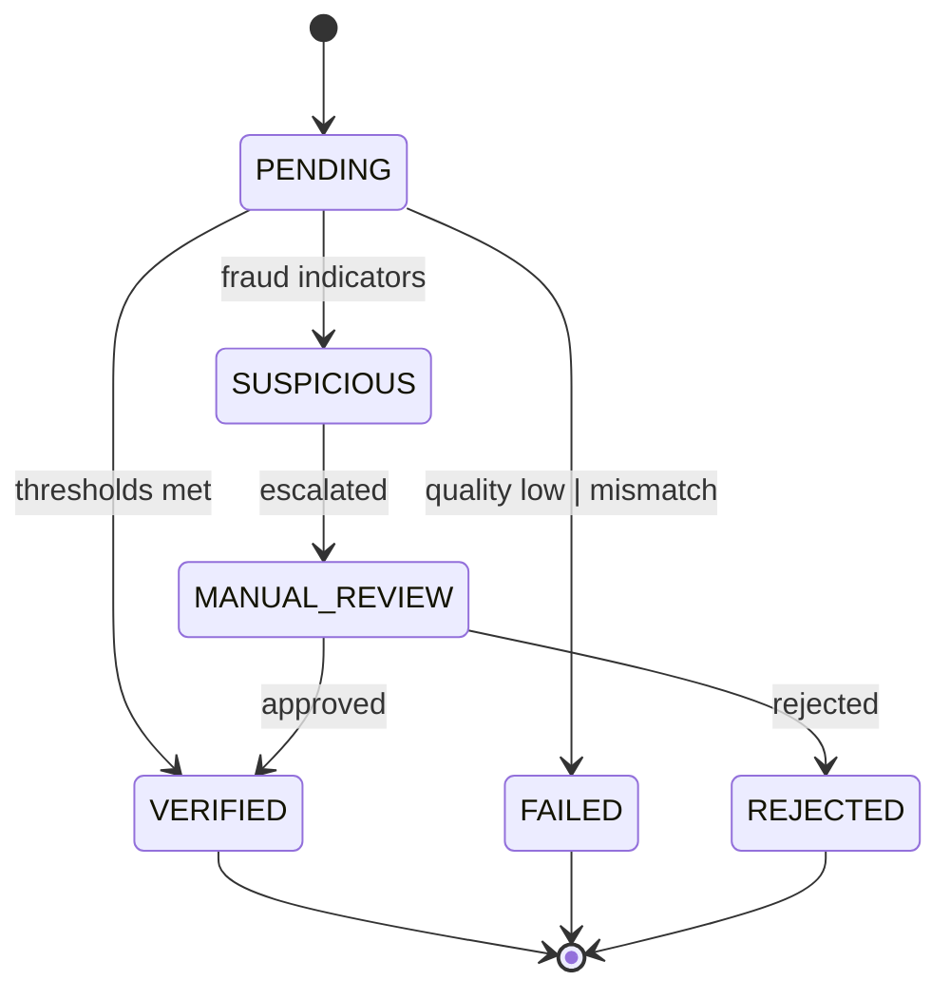

# Attendance & AI Verification

_Preamble: Attendance goes beyond logs—AI augments verification, flags anomalies, and powers dashboards. Learn the data model and how to work with AI results._

## Views & Flows
- Main view: `apps/attendance/views.py:Attendance` supports list, SOS/site crisis, geofence lookups, and CRUD.
- Conveyance (travel expense): `apps/attendance/views.py:Conveyance` with templates under `frontend/templates/attendance/`.

## AI Models
- File: `apps/attendance/ai_enhanced_models.py`
  - `AIAttendanceRecord`: verification status, modalities (FACE/VOICE/BEHAVIORAL), confidence/quality, fraud/liveness, context, recommendations, review workflow.
  - `PredictiveAttendanceInsight`: predictions (attendance/fraud/anomaly) with confidence, inputs, recommended actions, and impact.
  - Model performance metrics and audit trail types.

## Dashboards
- Aggregations and analytics in `apps/attendance/ai_analytics_dashboard.py`.

## Extending
- Add modalities by extending `BiometricModality`, ensure capture, scoring, and analytics fields.
- Tie mobile stream evidence via device/session identifiers (see Real‑Time chapter for WS flows).

## State Machine: Verification Status


## Model Relationships (ER Overview)
```mermaid
classDiagram
    class PeopleEventlog {+id
        datetime punchintime
        datetime punchouttime
        json peventlogextras
    }
    class AIAttendanceRecord {+verification_status
        +overall_confidence
        +fraud_risk_score
        +liveness_score
        +model_versions
    }
    class AttendanceAuditTrail {+action_type
        +notes
        +createdon
    }
    PeopleEventlog <|-- AIAttendanceRecord : one-to-one
    PeopleEventlog <o-- AttendanceAuditTrail : many
```

## Indexing & Query Tips
- Common filters: `verification_status`, `fraud_risk_score`, `requires_manual_review`, `createdon`.
- Ensure indexes (already present in models) and avoid unbounded range scans.
- Use `.only()`/`.defer()` to trim heavy JSON columns in list views.

## Stub Verification Pipeline
```python
def verify_attendance(pelog: PeopleEventlog, inputs) -> AIAttendanceRecord:
    # 1) quality checks
    q = compute_quality(inputs)
    # 2) modalities
    face_c = face_compare(inputs.face) if inputs.face else None
    voice_c = voice_compare(inputs.voice) if inputs.voice else None
    # 3) liveness/fraud indicators
    liveness = liveness_score(inputs)
    fraud = compute_fraud(inputs, pelog)
    # 4) aggregate and persist
    overall = aggregate_confidence(face_c, voice_c, q, liveness)
    status = classify_status(overall, q, liveness, fraud)
    return AIAttendanceRecord.objects.create(
        attendance_record=pelog,
        verification_status=status,
        overall_confidence=overall,
        face_confidence=face_c,
        voice_confidence=voice_c,
        liveness_score=liveness,
        fraud_risk_score=fraud,
        quality_analysis={"q": q},
    )
```

## Ops Notes
- Thresholds: set per-tenant defaults for confidence and liveness; allow overrides.
- Reviewer workflow: queue suspicious cases to a review UI; audit all updates.
- Retention: define retention for raw biometric samples (ideally not stored) vs. derived metrics.
- Performance: batch analytics; store only necessary details in JSON; archive old audit trails.

