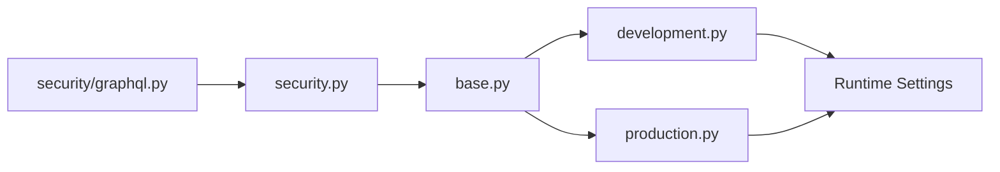

# GraphQL Security Settings Guide

**Last Updated:** 2025-10-01
**Settings Version:** 2.0
**Status:** ✅ Production Ready

## Table of Contents

1. [Overview](#overview)
2. [Architecture](#architecture)
3. [Settings Reference](#settings-reference)
4. [Environment Configuration](#environment-configuration)
5. [Validation & Monitoring](#validation--monitoring)
6. [Security Best Practices](#security-best-practices)
7. [Troubleshooting](#troubleshooting)
8. [Migration Guide](#migration-guide)

---

## Overview

### Single Source of Truth

All GraphQL security settings are centralized in a single location:

```
📦 intelliwiz_config/settings/security/graphql.py
```

**Why Centralization Matters:**
- ❌ **Before:** Settings duplicated across `base.py` and `security/graphql.py`
- ✅ **After:** Single source of truth prevents configuration drift
- ✅ **Benefit:** Changes made in one place, no risk of inconsistency
- ✅ **Compliance:** Follows Rule #6 (Settings files < 200 lines)

### Key Features

- 🔒 **Comprehensive Security**: Rate limiting, complexity validation, CSRF protection
- ⚙️ **Environment-Aware**: Different settings for dev/prod
- ✅ **Validated**: Settings validation on import with helpful error messages
- 📊 **Monitored**: Real-time validation via management command
- 🚫 **Protected**: Pre-commit hooks prevent duplication

---

## Architecture

### Import Chain



### File Responsibilities

| File | Purpose | Line Count | Status |
|------|---------|------------|--------|
| `security/graphql.py` | **Source of truth** for all GraphQL settings | ~220 | ✅ Compliant |
| `base.py` | Imports GraphQL settings (no definitions) | -16 lines | ✅ Cleaner |
| `development.py` | Development overrides (relaxed limits) | +30 lines | ✅ Enhanced |
| `production.py` | Production hardening (strict limits) | +40 lines | ✅ Secured |

---

## Settings Reference

### Endpoint Configuration

#### `GRAPHQL_PATHS`
- **Type:** `List[str]`
- **Default:** `['/api/graphql/', '/graphql/', '/graphql']`
- **Description:** GraphQL endpoint paths that require CSRF protection
- **Environment Variable:** N/A (static configuration)

```python
GRAPHQL_PATHS = [
    '/api/graphql/',  # Primary API endpoint
    '/graphql/',       # Alternative endpoint
    '/graphql'         # Legacy endpoint
]
```

---

### Rate Limiting Settings

#### `ENABLE_GRAPHQL_RATE_LIMITING`
- **Type:** `bool`
- **Default:** `True`
- **Description:** Enable GraphQL-specific rate limiting
- **Environment Variable:** `ENABLE_GRAPHQL_RATE_LIMITING`
- **Production:** `True` (MANDATORY)
- **Development:** `True` (recommended)

#### `GRAPHQL_RATE_LIMIT_MAX`
- **Type:** `int`
- **Default:** `100` requests
- **Description:** Maximum requests per time window
- **Environment Variable:** `GRAPHQL_RATE_LIMIT_MAX`
- **Production:** `50` (strict)
- **Development:** `1000` (relaxed)
- **Valid Range:** 1-10000

#### `GRAPHQL_RATE_LIMIT_WINDOW`
- **Type:** `int` (seconds)
- **Default:** `300` (5 minutes)
- **Description:** Time window for rate limiting
- **Environment Variable:** `GRAPHQL_RATE_LIMIT_WINDOW`
- **Valid Range:** 60-3600 seconds

**Example Configuration:**
```python
# Production: Strict rate limiting
GRAPHQL_RATE_LIMIT_MAX = 50
GRAPHQL_RATE_LIMIT_WINDOW = 300  # 50 requests per 5 minutes

# Development: Relaxed for testing
GRAPHQL_RATE_LIMIT_MAX = 1000
GRAPHQL_RATE_LIMIT_WINDOW = 300  # 1000 requests per 5 minutes
```

---

### Query Complexity Limits (DoS Prevention)

#### `GRAPHQL_MAX_QUERY_DEPTH`
- **Type:** `int`
- **Default:** `10` levels
- **Description:** Maximum nesting depth for GraphQL queries
- **Environment Variable:** `GRAPHQL_MAX_QUERY_DEPTH`
- **Production:** `8` (strict)
- **Development:** `15` (relaxed)
- **Valid Range:** 1-50
- **Security:** Prevents deep nesting attacks

#### `GRAPHQL_MAX_QUERY_COMPLEXITY`
- **Type:** `int`
- **Default:** `1000` points
- **Description:** Maximum complexity score for queries
- **Environment Variable:** `GRAPHQL_MAX_QUERY_COMPLEXITY`
- **Production:** `800` (strict)
- **Development:** `2000` (relaxed)
- **Security:** Prevents complexity bomb attacks

#### `GRAPHQL_MAX_MUTATIONS_PER_REQUEST`
- **Type:** `int`
- **Default:** `5` mutations
- **Description:** Maximum mutations in a single batch request
- **Environment Variable:** `GRAPHQL_MAX_MUTATIONS_PER_REQUEST`
- **Production:** `3` (strict)
- **Development:** `10` (relaxed)
- **Valid Range:** 1-20
- **Security:** Prevents batch attack abuse

#### `GRAPHQL_ENABLE_COMPLEXITY_VALIDATION`
- **Type:** `bool`
- **Default:** `True`
- **Description:** Enable runtime complexity validation
- **Environment Variable:** `GRAPHQL_ENABLE_COMPLEXITY_VALIDATION`
- **Critical:** MUST be `True` for DoS prevention

#### `GRAPHQL_ENABLE_VALIDATION_CACHE`
- **Type:** `bool`
- **Default:** `True`
- **Description:** Cache validation results for performance
- **Environment Variable:** `GRAPHQL_ENABLE_VALIDATION_CACHE`

#### `GRAPHQL_VALIDATION_CACHE_TTL`
- **Type:** `int` (seconds)
- **Default:** `300` (5 minutes)
- **Description:** Cache TTL for validation results
- **Environment Variable:** `GRAPHQL_VALIDATION_CACHE_TTL`
- **Valid Range:** 1-3600 seconds

---

### Introspection Control

#### `GRAPHQL_DISABLE_INTROSPECTION_IN_PRODUCTION`
- **Type:** `bool`
- **Default:** `True`
- **Description:** Disable GraphQL introspection in production
- **Environment Variable:** `GRAPHQL_DISABLE_INTROSPECTION_IN_PRODUCTION`
- **Production:** `True` (MANDATORY for security)
- **Development:** `False` (useful for GraphiQL)
- **Security:** Prevents schema enumeration attacks

---

### CSRF Protection

#### `GRAPHQL_CSRF_HEADER_NAMES`
- **Type:** `List[str]`
- **Default:** `['HTTP_X_CSRFTOKEN', 'HTTP_X_CSRF_TOKEN']`
- **Description:** CSRF header names that mutations must include
- **Environment Variable:** N/A (static configuration)

```python
# Middleware checks for these headers in GraphQL mutation requests
GRAPHQL_CSRF_HEADER_NAMES = [
    'HTTP_X_CSRFTOKEN',  # Django standard
    'HTTP_X_CSRF_TOKEN',  # Alternative
]
```

---

### Origin Validation

#### `GRAPHQL_ALLOWED_ORIGINS`
- **Type:** `List[str]`
- **Default:** `[]` (allow all with CORS)
- **Description:** Allowed origins for GraphQL requests
- **Environment Variable:** `GRAPHQL_ALLOWED_ORIGINS` (comma-separated)
- **Production:** Specific domains only
- **Development:** Localhost addresses

```python
# Production: Whitelist specific origins
GRAPHQL_ALLOWED_ORIGINS = [
    'https://django5.youtility.in',
    'https://app.youtility.in',
]

# Development: Allow local development servers
GRAPHQL_ALLOWED_ORIGINS = [
    'http://localhost:3000',
    'http://127.0.0.1:3000',
    'http://localhost:8000',
    'http://127.0.0.1:8000',
]
```

#### `GRAPHQL_STRICT_ORIGIN_VALIDATION`
- **Type:** `bool`
- **Default:** `False`
- **Description:** Enforce strict origin validation
- **Environment Variable:** `GRAPHQL_STRICT_ORIGIN_VALIDATION`
- **Production:** `True` (MANDATORY)
- **Development:** `False` (relaxed for testing)

---

### Security Logging

#### `GRAPHQL_SECURITY_LOGGING`
- **Type:** `dict`
- **Description:** Comprehensive security logging configuration
- **Environment Variables:** Individual flags (see below)

```python
GRAPHQL_SECURITY_LOGGING = {
    'ENABLE_REQUEST_LOGGING': True,      # Log all GraphQL requests
    'ENABLE_MUTATION_LOGGING': True,     # Log mutations specifically
    'ENABLE_RATE_LIMIT_LOGGING': True,   # Log rate limit violations
    'ENABLE_FIELD_ACCESS_LOGGING': True, # Log field access patterns
    'ENABLE_OBJECT_ACCESS_LOGGING': True,# Log object access patterns
    'LOG_FAILED_CSRF_ATTEMPTS': True,    # Log CSRF failures
}
```

**Environment Variables:**
- `GRAPHQL_LOG_REQUESTS` → `ENABLE_REQUEST_LOGGING`
- `GRAPHQL_LOG_MUTATIONS` → `ENABLE_MUTATION_LOGGING`
- `GRAPHQL_LOG_RATE_LIMITS` → `ENABLE_RATE_LIMIT_LOGGING`
- `GRAPHQL_LOG_FIELD_ACCESS` → `ENABLE_FIELD_ACCESS_LOGGING`
- `GRAPHQL_LOG_OBJECT_ACCESS` → `ENABLE_OBJECT_ACCESS_LOGGING`
- `GRAPHQL_LOG_CSRF_FAILURES` → `LOG_FAILED_CSRF_ATTEMPTS`

---

### JWT Authentication

#### `GRAPHQL_JWT`
- **Type:** `dict`
- **Description:** JWT configuration for GraphQL authentication

```python
GRAPHQL_JWT = {
    "JWT_VERIFY_EXPIRATION": True,  # SECURITY: Must be True
    "JWT_EXPIRATION_DELTA": timedelta(hours=8),  # Token lifetime
    "JWT_REFRESH_EXPIRATION_DELTA": timedelta(days=2),  # Refresh lifetime
    "JWT_LONG_RUNNING_REFRESH_TOKEN": True
}
```

**Environment Variables:**
- `GRAPHQL_JWT_EXPIRATION_HOURS` (default: 8)
- `GRAPHQL_JWT_REFRESH_DAYS` (default: 2)

**Production Override:**
```python
# Stricter timeouts in production
GRAPHQL_JWT["JWT_EXPIRATION_DELTA"] = timedelta(hours=2)
```

---

## Environment Configuration

### Development Environment

**Location:** `intelliwiz_config/settings/development.py`

**Characteristics:**
- ✅ Relaxed rate limits for testing
- ✅ GraphQL introspection enabled
- ✅ No origin validation
- ✅ Higher complexity limits

```python
# Development overrides (lines 154-178)
GRAPHQL_RATE_LIMIT_MAX = 1000
GRAPHQL_DISABLE_INTROSPECTION_IN_PRODUCTION = False
GRAPHQL_STRICT_ORIGIN_VALIDATION = False
GRAPHQL_MAX_QUERY_DEPTH = 15
GRAPHQL_MAX_QUERY_COMPLEXITY = 2000
GRAPHQL_MAX_MUTATIONS_PER_REQUEST = 10
```

### Production Environment

**Location:** `intelliwiz_config/settings/production.py`

**Characteristics:**
- 🔒 Strict rate limits
- 🔒 Introspection disabled (MANDATORY)
- 🔒 Strict origin validation (MANDATORY)
- 🔒 Conservative complexity limits

```python
# Production security hardening (lines 124-166)
GRAPHQL_RATE_LIMIT_MAX = 50
GRAPHQL_DISABLE_INTROSPECTION_IN_PRODUCTION = True  # Enforced with assertion
GRAPHQL_STRICT_ORIGIN_VALIDATION = True  # Enforced with assertion
GRAPHQL_MAX_QUERY_DEPTH = 8
GRAPHQL_MAX_QUERY_COMPLEXITY = 800
GRAPHQL_MAX_MUTATIONS_PER_REQUEST = 3

# Production validates critical settings
assert GRAPHQL_DISABLE_INTROSPECTION_IN_PRODUCTION, "Production MUST disable introspection"
assert GRAPHQL_STRICT_ORIGIN_VALIDATION, "Production MUST enforce strict origin validation"
```

---

## Validation & Monitoring

### Automatic Validation

Settings are validated on module import:

```python
# In security/graphql.py (lines 136-181)
def validate_graphql_settings():
    """Validate GraphQL security settings on module import."""
    errors = []

    # Validate rate limiting
    if GRAPHQL_RATE_LIMIT_MAX <= 0:
        errors.append("GRAPHQL_RATE_LIMIT_MAX must be positive")

    # ... more validation checks

    if errors:
        raise ValueError(f"GraphQL settings validation failed:\n{errors}")
```

### Management Command

Validate configuration at any time:

```bash
# Basic validation
python manage.py validate_graphql_config

# Check for duplicates
python manage.py validate_graphql_config --check-duplicates

# Generate detailed report
python manage.py validate_graphql_config --report

# Validate specific environment
python manage.py validate_graphql_config --environment production
```

**Output Example:**
```
======================================================================
  GraphQL Configuration Validation
======================================================================

✅ Passed Checks (18):
  ✓ Setting loaded: GRAPHQL_PATHS
  ✓ Setting loaded: ENABLE_GRAPHQL_RATE_LIMITING
  ✓ Rate limit: 100 (reasonable)
  ✓ Query depth: 10 (safe)
  ...

⚠️  Warnings (1):
  ⚠ Development has introspection enabled (expected for dev)

✅ GraphQL configuration validation passed!
```

### Pre-commit Protection

Pre-commit hook automatically prevents duplication:

```bash
# Runs automatically on git commit
🔍 Django Code Quality Pre-commit Hook

Checking: Architecture Rule #6.5: GraphQL Settings Centralization

❌ RULE VIOLATION: GraphQL Settings Duplication
   📁 File: intelliwiz_config/settings/base.py:175
   💬 Issue: GRAPHQL_PATHS must only be defined in intelliwiz_config/settings/security/graphql.py
   📖 Rule: See .claude/rules.md - Single Source of Truth
```

---

## Security Best Practices

### 1. Production Checklist

Before deploying to production, verify:

- [ ] ✅ `GRAPHQL_DISABLE_INTROSPECTION_IN_PRODUCTION = True`
- [ ] ✅ `GRAPHQL_STRICT_ORIGIN_VALIDATION = True`
- [ ] ✅ `GRAPHQL_RATE_LIMIT_MAX <= 100`
- [ ] ✅ `GRAPHQL_MAX_QUERY_DEPTH <= 10`
- [ ] ✅ `GRAPHQL_MAX_MUTATIONS_PER_REQUEST <= 5`
- [ ] ✅ `GRAPHQL_ALLOWED_ORIGINS` contains only trusted domains
- [ ] ✅ All security logging flags enabled

**Validation Command:**
```bash
python manage.py validate_graphql_config --environment production
```

### 2. Never Override These in Production

These settings MUST remain strict in production:

```python
# ❌ DANGEROUS - Do NOT do this in production
GRAPHQL_DISABLE_INTROSPECTION_IN_PRODUCTION = False  # Security risk!
GRAPHQL_STRICT_ORIGIN_VALIDATION = False  # Security risk!
GRAPHQL_RATE_LIMIT_MAX = 10000  # DoS risk!
```

### 3. Environment Variable Best Practices

Use environment variables for environment-specific values:

```bash
# .env.prod.secure
GRAPHQL_RATE_LIMIT_MAX=50
GRAPHQL_MAX_QUERY_DEPTH=8
GRAPHQL_STRICT_ORIGIN_VALIDATION=True
GRAPHQL_ALLOWED_ORIGINS=https://django5.youtility.in,https://app.youtility.in
```

### 4. Monitoring Recommendations

**Monitor these metrics:**
- Rate limit violations (should be < 1% of requests)
- Complexity validation failures (investigate patterns)
- CSRF failures (potential attack indicators)
- Query depth violations (potential attack indicators)

**Alert Thresholds:**
- Rate limit violations > 100/hour → Investigate
- Complexity failures > 50/hour → Review queries
- CSRF failures > 10/hour → Security incident

---

## Troubleshooting

### Issue: Settings Not Loading

**Symptoms:**
- `AttributeError: 'Settings' object has no attribute 'GRAPHQL_PATHS'`

**Solution:**
```bash
# Check if settings are imported correctly
python manage.py shell
>>> from django.conf import settings
>>> print(settings.GRAPHQL_PATHS)

# If missing, check import in base.py
grep "from .security.graphql import" intelliwiz_config/settings/base.py
```

### Issue: Validation Fails on Import

**Symptoms:**
- Django won't start
- Error: "GraphQL settings validation failed"

**Solution:**
```bash
# Check validation errors
python manage.py validate_graphql_config --report

# Common issues:
# - GRAPHQL_RATE_LIMIT_MAX <= 0
# - GRAPHQL_MAX_QUERY_DEPTH > 50
# - Empty GRAPHQL_PATHS list
```

### Issue: Pre-commit Hook Blocks Commit

**Symptoms:**
- Commit rejected with "GraphQL Settings Duplication"

**Solution:**
```bash
# Remove duplicate settings from base.py
# Settings must ONLY be in security/graphql.py

# Verify no duplicates
python manage.py validate_graphql_config --check-duplicates
```

### Issue: Rate Limiting Too Strict

**Symptoms:**
- Legitimate requests blocked
- Error: "GraphQL rate limit exceeded"

**Solution:**
```python
# Adjust rate limit for your environment
# Development: intelliwiz_config/settings/development.py
GRAPHQL_RATE_LIMIT_MAX = 1000  # Increase for development

# Production: Use environment variable
# .env.prod.secure
GRAPHQL_RATE_LIMIT_MAX=150  # Carefully increase if needed
```

---

## Migration Guide

### From Old Configuration (Pre-2025-10-01)

If you're migrating from the old duplicated configuration:

**Step 1: Remove Duplicates**
```bash
# Let the management command identify issues
python manage.py validate_graphql_config --check-duplicates
```

**Step 2: Verify Import**
```python
# intelliwiz_config/settings/base.py should have:
from .security.graphql import (
    GRAPHQL_PATHS,
    ENABLE_GRAPHQL_RATE_LIMITING,
    # ... all other settings
)
```

**Step 3: Run Tests**
```bash
# Verify backward compatibility
python -m pytest apps/core/tests/test_graphql_settings_centralization.py -v
python -m pytest apps/core/tests/test_graphql_settings_validation.py -v
```

**Step 4: Verify Middleware**
```bash
# Check middleware can access settings
python manage.py shell
>>> from apps.core.middleware.graphql_rate_limiting import GraphQLRateLimitingMiddleware
>>> middleware = GraphQLRateLimitingMiddleware(lambda r: None)
>>> print(middleware.graphql_paths)  # Should print paths list
```

---

## Support & Maintenance

### Getting Help

1. **Check validation:**
   ```bash
   python manage.py validate_graphql_config --report
   ```

2. **Run tests:**
   ```bash
   python -m pytest apps/core/tests/test_graphql_settings* -v
   ```

3. **Review documentation:**
   - This guide
   - `.claude/rules.md`
   - `CLAUDE.md`

### Reporting Issues

When reporting GraphQL configuration issues, include:

1. Output from `python manage.py validate_graphql_config --report`
2. Environment (development/production)
3. Relevant settings values
4. Error messages with full traceback

### Version History

| Version | Date | Changes |
|---------|------|---------|
| 2.0 | 2025-10-01 | Centralized settings, removed duplication |
| 1.0 | 2025-09-01 | Initial security configuration |

---

**Questions?** Check `CLAUDE.md` or contact the platform team.
