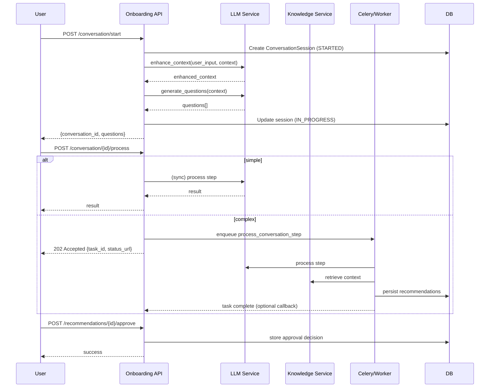

# Conversational Onboarding API

_Preamble: A guided onboarding engine using LLMs, translation, and a knowledge base. Feature flags support gradual rollout and strict budgets._

## Views & Flow
- Views: `apps/onboarding_api/views.py`, `apps/onboarding_api/views_phase2.py`
  - `ConversationStartView`: validates one active session; seeds initial questions via LLM services
  - `ConversationProcessView`: routes to async background task if complex; returns status URLs
- Services: `apps/onboarding_api/services/` (llm, translation, knowledge backends)

## Feature Flags & Budgets
- Settings: see `intelliwiz_config/settings.py` for flags like `ENABLE_CONVERSATIONAL_ONBOARDING`, vector backend, translation caching, cost tracking, PII redaction, and daily budgets.

## Extending
- Add LLM providers with clear timeouts and token budgets.
- Use knowledge base allowlists and citation tracking; respect content licensing settings.

## Session States & Transitions
- States (typical): `STARTED` → `IN_PROGRESS` → `GENERATING_RECOMMENDATIONS` → `AWAITING_USER_APPROVAL` → `COMPLETED`
- Error/cancel paths: `ERROR`, `CANCELLED` (stale sessions auto-close after inactivity)
- Transition rules enforced in `ConversationSession` views; only one active per user/client.

Sequence (high level)
1) Start: validate tenant, concurrency guard → seed initial questions
2) Process: sync/async decision (complexity) → background Celery task if async
3) Recommendations: persist `LLMRecommendation` with citations/risks
4) Approval: permission `CanApproveAIRecommendations` gate → apply or escalate
5) Finalize/Cancel: store decision, costs, and audit trail

## Provider Adapter Interface
Implement provider services in `apps/onboarding_api/services/llm`:
- `enhance_context(user_input: str, context: dict, user) -> dict`
- `generate_questions(context: dict, conversation_type: str) -> list[str]`
- `make_recommendations(context: dict, collected_data: dict) -> list[dict]`
- Optional checker/reviewer: `validate_recommendations(recs: list[dict]) -> list[dict]`

Guidelines
- Timeouts per call (e.g., 10–30s); retries with backoff and idempotent request IDs.
- Deterministic prompts for testability; include provider/model metadata in results.

## Cost Tracking & Rate Limits
- Settings of interest (examples):
  - `ENABLE_COST_TRACKING`, `DAILY_COST_BUDGET_CENTS`
  - `ONBOARDING_API_RATE_LIMIT_WINDOW`, `ONBOARDING_API_MAX_REQUESTS`
  - Token budgets per step: `TOKEN_BUDGET_MAKER_SIMPLE`, `TOKEN_BUDGET_MAKER_COMPLEX`, `TOKEN_BUDGET_CHECKER`
- Persist cost per session; deny if budget exceeded; surface budget hints in responses.

## Knowledge Base Ingestion & Retrieval
- Allowed sources: `KB_ALLOWED_SOURCES`; enforce domain allowlist.
- Chunking: `KNOWLEDGE_CHUNK_SIZE`, `KNOWLEDGE_CHUNK_OVERLAP`, `KB_MAX_CHUNK_TOKENS`.
- Backends: `ONBOARDING_VECTOR_BACKEND` (postgres_array | pgvector | chroma).
- Retrieval: `KB_TOP_K` with caching (`EMBEDDING_CACHE_TIMEOUT`), rate limiting (`KB_RATE_LIMIT_DELAY`).
- Licensing: block patterns via `KB_BLOCKED_LICENSE_PATTERNS`; track attribution `KB_ATTRIBUTION_PATTERNS`.

## Error Taxonomy & Recovery
- Client errors: validation (400), permission (403), conflict (409 active session), rate limit (429).
- Server errors: provider failure (502‑like), timeout (504‑like), background task failure (202→failure state).
- Recovery: allow resume via `resume_existing`; stale sessions auto‑close; provide status endpoints and `friendly_task_id`.

## Sequence Diagram (Session Flow)

