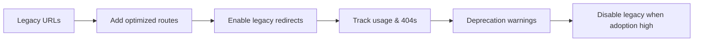

# Core & Information Architecture

_Preamble: Core consolidates cross‑cutting concerns—middleware, caching, routing, and IA. Learn the routing model and how to add new IA‑friendly routes._

## URLs & IA
- Optimized routes: `intelliwiz_config/urls_optimized.py`
- Core domain URL groups: `apps/core/urls_people.py`, `apps/core/urls_operations.py`, `apps/core/urls_assets.py`, `apps/core/urls_helpdesk.py`, `apps/core/urls_dashboard.py`, `apps/core/urls_admin.py`
- IA overlay & flags: `intelliwiz_config/settings_ia.py` (`USE_OPTIMIZED_URLS`, `ENABLE_LEGACY_URLS`, breadcrumbs, tracking)

## Middleware & Utilities
- Security: CSP nonce, XSS, SQLi, correlation IDs, global exception handling (`apps/core/*`)
- Utils: `apps/core/utils_new/` (file, query, validation, security, date, optimization)
- Caching strategies and manager: `apps/core/cache_*`

## Extending
- Add a new domain file under `apps/core/urls_<domain>.py` and mount in `urls_optimized.py`.
- Use `apps/core/decorators.py` and error handling helpers to standardize behavior.

## Migration Plan (Legacy → Optimized URLs)


## Example: Add a New Domain
```python
# apps/core/urls_training.py
from django.urls import path
from apps.training import views

app_name = 'training'
urlpatterns = [
  path('', views.List.as_view(), name='list'),
  path('<int:pk>/', views.Detail.as_view(), name='detail'),
]
```

```python
# intelliwiz_config/urls_optimized.py (excerpt)
urlpatterns = [
  # ...
  path('training/', include('apps.core.urls_training')),
]
```

## Navigation Tracking & Breadcrumbs
- Feature flags in `intelliwiz_config/settings_ia.py` control tracking/breadcrumbs.
- Cache menus/breadcrumbs with `NAV_MENU_CACHE_TIMEOUT` to avoid recomputation.

## Cache Keys & Invalidation
- Use consistent key prefixes per domain, e.g., `people:list:{tenant}:{filter_hash}`.
- Invalidate on model save/delete hooks; for tree structures (BU), clear parent/ancestor caches.

## Troubleshooting
- Dead URLs: add a custom 404 that logs the referrer and path; analyze and add smart redirects.
- Mixed routing: ensure legacy and optimized patterns don’t shadow each other; namespace routes.

