# Decision Trees - Best Practices Guide

**Purpose:** Visual decision-making guides for common development scenarios

**Last Updated:** November 6, 2025

---

## 📋 Table of Contents

1. [Query Optimization Decision Tree](#1-query-optimization-decision-tree)
2. [Exception Type Selection Tree](#2-exception-type-selection-tree)
3. [Authentication Method Selection](#3-authentication-method-selection)
4. [Refactoring Pattern Selection](#4-refactoring-pattern-selection)
5. [Service vs Model Logic](#5-service-vs-model-logic)
6. [Caching Strategy Selection](#6-caching-strategy-selection)
7. [Testing Strategy Selection](#7-testing-strategy-selection)

---

## 1. Query Optimization Decision Tree

**When:** Optimizing database queries to prevent N+1 problems

```mermaid
graph TD
    A[Database Query] --> B{Need related<br/>objects?}
    
    B -->|No| C{Need all<br/>fields?}
    B -->|Yes| D{Relationship<br/>type?}
    
    C -->|Yes| E[Use .all]
    C -->|No| F[Use .only or<br/>.values]
    
    D -->|ForeignKey<br/>OneToOne| G[select_related]
    D -->|ManyToMany<br/>Reverse FK| H[prefetch_related]
    
    G --> I{Need all<br/>fields?}
    H --> J{Filter related<br/>objects?}
    
    I -->|Yes| K[select_related only]
    I -->|No| L[select_related<br/>+ .only]
    
    J -->|Yes| M[Prefetch with<br/>custom queryset]
    J -->|No| N[prefetch_related<br/>only]
    
    E --> O[Optimized]
    F --> O
    K --> O
    L --> O
    M --> O
    N --> O
    
    style O fill:#90EE90
    style E fill:#FFE4B5
    style F fill:#FFE4B5
    style K fill:#FFE4B5
    style L fill:#FFE4B5
    style M fill:#FFE4B5
    style N fill:#FFE4B5
```



### Code Examples

#### Scenario 1: ForeignKey with all fields
```python
# select_related for ForeignKey
tasks = Task.objects.select_related('site', 'created_by').all()
```

#### Scenario 2: ForeignKey with specific fields
```python
# select_related + .only for partial fields
tasks = Task.objects.select_related('site', 'created_by').only(
    'id', 'title', 'status',
    'site__name',
    'created_by__username'
)
```

#### Scenario 3: ManyToMany without filtering
```python
# prefetch_related for ManyToMany
tasks = Task.objects.prefetch_related('assigned_people').all()
```

#### Scenario 4: ManyToMany with filtering
```python
# Prefetch with custom queryset
from django.db.models import Prefetch

tasks = Task.objects.prefetch_related(
    Prefetch(
        'assigned_people',
        queryset=People.objects.filter(is_active=True).select_related('profile'),
        to_attr='active_assignees'
    )
).all()
```

---

## 2. Exception Type Selection Tree

**When:** Deciding which exception to catch/raise


### Code Examples

#### Database Exceptions
```python
from apps.core.exceptions.patterns import DATABASE_EXCEPTIONS

try:
    user.save()
except DATABASE_EXCEPTIONS as e:
    logger.error(f"Database error: {e}", exc_info=True)
    raise
```

#### Network Exceptions
```python
from apps.core.exceptions.patterns import NETWORK_EXCEPTIONS

try:
    response = requests.get(url, timeout=(5, 15))
except NETWORK_EXCEPTIONS as e:
    logger.error(f"Network error: {e}", exc_info=True)
    raise
```

#### Custom Business Exception
```python
# apps/activity/exceptions.py
class TaskOverdueError(Exception):
    """Raised when attempting to modify overdue task."""
    pass

# Usage
if task.due_date < timezone.now():
    raise TaskOverdueError(f"Task {task.id} is overdue")
```

---

## 3. Authentication Method Selection

**When:** Choosing authentication for an API endpoint

```mermaid
graph TD
    A[API Endpoint] --> B{Who calls<br/>this endpoint?}
    
    B -->|Third-party service<br/>webhook| C[HMAC Signature<br/>Authentication]
    B -->|Authenticated<br/>users| D{Session<br/>exists?}
    B -->|Mobile apps/<br/>API clients| E[Token<br/>Authentication]
    B -->|Public endpoint| F{Rate limit<br/>needed?}
    
    D -->|Yes - web browser| G[Session Auth<br/>+ CSRF]
    D -->|No - API only| E
    
    C --> H[Use @csrf_exempt<br/>with HMAC validation]
    E --> I[TokenAuthentication<br/>+ IsAuthenticated]
    G --> J[@csrf_protect +<br/>@login_required]
    
    F -->|Yes| K[Anonymous rate<br/>limiting]
    F -->|No| L[No auth required]
    
    style H fill:#FFE4B5
    style I fill:#90EE90
    style J fill:#90EE90
    style K fill:#FFB6C1
    style L fill:#FFB6C1
```

### Code Examples

#### HMAC for Webhooks
```python
import hmac
from django.views.decorators.csrf import csrf_exempt

@csrf_exempt  # Safe with HMAC
def webhook_receiver(request):
    signature = request.headers.get('X-Signature')
    expected = hmac.new(settings.SECRET, request.body, 'sha256').hexdigest()
    
    if not hmac.compare_digest(signature, expected):
        return JsonResponse({'error': 'Invalid signature'}, status=403)
    
    # Process webhook
```

#### Token for APIs
```python
from rest_framework.decorators import api_view, permission_classes
from rest_framework.permissions import IsAuthenticated

@api_view(['POST'])
@permission_classes([IsAuthenticated])
def api_endpoint(request):
    # User guaranteed authenticated
    return Response({'user': request.user.username})
```

#### Session for Web
```python
from django.contrib.auth.decorators import login_required
from django.views.decorators.csrf import csrf_protect

@csrf_protect
@login_required
def web_endpoint(request):
    return JsonResponse({'data': get_user_data(request.user)})
```

---

## 4. Refactoring Pattern Selection

**When:** Deciding how to split a god file


### Examples

#### Models by Domain
```
apps/attendance/models/
├── __init__.py
├── attendance.py      # Attendance model
├── leave.py           # Leave model
├── overtime.py        # Overtime model
└── gps_consent.py     # GPSConsent model
```

#### Views by Feature
```
apps/work_order_management/views/
├── __init__.py
├── work_order_views.py    # CRUD operations
├── approval_views.py      # Approval workflow
├── vendor_views.py        # Vendor management
└── analytics_views.py     # Reports
```

---

## 5. Service vs Model Logic

**When:** Deciding where to put logic


### Examples

#### Property on Model (Simple)
```python
class Task(models.Model):
    due_date = models.DateTimeField()
    
    @property
    def is_overdue(self):
        """Simple field-based calculation."""
        from django.utils import timezone
        return self.due_date < timezone.now()
```

#### Service Layer (Complex)
```python
class WorkOrderService:
    @staticmethod
    def approve_work_order(work_order_id, approved_by):
        """
        Multi-step operation with side effects.
        
        - Validates permissions
        - Updates status
        - Sends notifications
        - Triggers workflows
        """
        # Complex business logic
```

#### Custom Manager (Reusable Query)
```python
class TaskManager(models.Manager):
    def overdue(self):
        """Reusable query for overdue tasks."""
        from django.utils import timezone
        return self.filter(
            status__in=['PENDING', 'IN_PROGRESS'],
            due_date__lt=timezone.now()
        )

# Usage
overdue_tasks = Task.objects.overdue()
```

---

## 6. Caching Strategy Selection

**When:** Deciding what and how to cache


### Examples

#### Static Data (Long TTL)
```python
from django.core.cache import cache

def get_site_config():
    """Site config rarely changes - cache for 24 hours."""
    key = 'site_config'
    config = cache.get(key)
    
    if config is None:
        config = SiteConfig.objects.get()
        cache.set(key, config, timeout=86400)  # 24 hours
    
    return config
```

#### User-Specific Cache
```python
def get_user_dashboard(user_id):
    """Cache per-user dashboard data."""
    key = f'dashboard_{user_id}'
    data = cache.get(key)
    
    if data is None:
        data = DashboardService.generate_data(user_id)
        cache.set(key, data, timeout=3600)  # 1 hour
    
    return data
```

#### Event-Driven Invalidation
```python
from django.db.models.signals import post_save
from django.dispatch import receiver

@receiver(post_save, sender=SiteConfig)
def invalidate_site_config_cache(sender, instance, **kwargs):
    """Invalidate cache when config changes."""
    cache.delete('site_config')
```

---

## 7. Testing Strategy Selection

**When:** Deciding what type of test to write


### Examples

#### Service Layer Test
```python
class WorkOrderServiceTests(TestCase):
    """Test business logic without HTTP."""
    
    def test_create_work_order(self):
        work_order = WorkOrderService.create_work_order(
            title='Fix door',
            site_id=self.site.id,
            created_by=self.user,
            tenant=self.tenant
        )
        
        self.assertEqual(work_order.status, 'PENDING')
```

#### API Test
```python
class WorkOrderAPITests(APITestCase):
    """Test API endpoints."""
    
    def test_create_work_order_api(self):
        self.client.force_authenticate(user=self.user)
        
        response = self.client.post('/api/work-orders/', {
            'title': 'Fix door',
            'site_id': self.site.id
        })
        
        self.assertEqual(response.status_code, 201)
```

#### IDOR Security Test
```python
class IDORTests(APITestCase):
    """Test authorization vulnerabilities."""
    
    def test_user_cannot_access_other_users_files(self):
        self.client.force_authenticate(user=self.user2)
        
        # Attempt to access user1's file
        response = self.client.get(f'/download?id={self.user1_file.id}')
        
        # Must be denied
        self.assertEqual(response.status_code, 403)
```

---

## Quick Reference Cards

### Query Optimization

| Scenario | Solution | Code |
|----------|----------|------|
| ForeignKey in loop | `select_related()` | `Task.objects.select_related('site')` |
| ManyToMany in loop | `prefetch_related()` | `Task.objects.prefetch_related('tags')` |
| Subset of fields | `.only()` or `.values()` | `Task.objects.only('id', 'title')` |
| Filtered related | `Prefetch()` | `Prefetch('tags', queryset=Tag.objects.filter(active=True))` |

### Exception Handling

| Operation | Exception Group | Import |
|-----------|-----------------|--------|
| Database | `DATABASE_EXCEPTIONS` | `from apps.core.exceptions.patterns import DATABASE_EXCEPTIONS` |
| Network | `NETWORK_EXCEPTIONS` | `from apps.core.exceptions.patterns import NETWORK_EXCEPTIONS` |
| Files | `FILE_EXCEPTIONS` | `from apps.core.exceptions.patterns import FILE_EXCEPTIONS` |
| Validation | `ValidationError` | `from django.core.exceptions import ValidationError` |

### Authentication

| Client Type | Method | Decorator |
|-------------|--------|-----------|
| Web browser | Session + CSRF | `@csrf_protect + @login_required` |
| Mobile app | Token | `@permission_classes([IsAuthenticated])` |
| Webhook | HMAC | `@csrf_exempt with HMAC validation` |
| Public | None/Rate limit | `@ratelimit` |

---

## References

- **[Query Optimization Architecture](../architecture/QUERY_OPTIMIZATION_ARCHITECTURE.md)** - Complete optimization guide
- **[Exception Handling Quick Reference](../quick_reference/EXCEPTION_HANDLING_QUICK_REFERENCE.md)** - Exception patterns
- **[Refactoring Playbook](../architecture/REFACTORING_PLAYBOOK.md)** - Refactoring strategies
- **[Best Practices Index](BEST_PRACTICES_INDEX.md)** - All best practices articles

---

**Questions?** Submit a Help Desk ticket with tag `best-practices-decisions`
