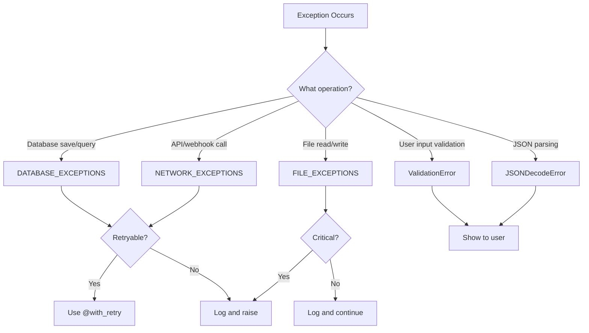

# Best Practices: Exception Handling

**ID:** BP-QUAL-001  
**Category:** Code Quality Best Practices  
**Difficulty:** Beginner  
**Last Updated:** November 6, 2025

---

## Overview

Proper exception handling prevents silent failures, improves debugging, and enables graceful error recovery.

**Golden Rule:** NEVER use `except Exception:` - Always catch specific exceptions.

---

## ❌ Anti-Patterns (FORBIDDEN)

### 1. Bare Exception Catch (MOST DANGEROUS)

```python
# ❌ FORBIDDEN: Catches EVERYTHING including SystemExit, KeyboardInterrupt
try:
    user.save()
except:  # ⚠️ CRITICAL VIOLATION
    pass
```

**Why This Is Dangerous:**
- Catches `KeyboardInterrupt` (Ctrl+C won't work)
- Catches `SystemExit` (prevents graceful shutdown)
- Hides bugs and makes debugging impossible

### 2. Generic Exception Without Specific Type

```python
# ❌ FORBIDDEN: Too broad
try:
    user.save()
except Exception as e:  # ⚠️ Hides real errors
    logger.error("Error saving user")  # No context!
    return None  # Silent failure
```

**Problems:**
- Can't distinguish between database errors, validation errors, network errors
- Masks programming mistakes
- No specific error handling

### 3. Silent Failures

```python
# ❌ FORBIDDEN: Swallow errors
try:
    send_email(user)
except Exception:
    pass  # ⚠️ Email never sent, no one knows
```

---

## ✅ Required Patterns

### 1. Use Specific Exception Types

```python
from apps.core.exceptions.patterns import DATABASE_EXCEPTIONS, NETWORK_EXCEPTIONS
from django.core.exceptions import ValidationError
import logging

logger = logging.getLogger(__name__)

def save_user_with_retry(user):
    """
    Save user with specific error handling.
    
    Handles database errors differently than validation errors.
    """
    try:
        user.full_clean()  # Validate first
        user.save()
        
    except ValidationError as e:
        # Validation errors are user's fault - don't retry
        logger.warning(f"Validation failed for user {user.id}: {e}")
        raise  # Re-raise to show user
        
    except DATABASE_EXCEPTIONS as e:
        # Database errors might be transient - retry makes sense
        logger.error(f"Database error saving user {user.id}: {e}", exc_info=True)
        raise  # Let retry mechanism handle it
```

### 2. Exception Pattern Groups (Recommended)

```python
# apps/core/exceptions/patterns.py

from django.db import (
    IntegrityError,
    OperationalError,
    DatabaseError
)
from requests.exceptions import (
    RequestException,
    Timeout,
    ConnectionError
)

# Database exception group
DATABASE_EXCEPTIONS = (
    IntegrityError,
    OperationalError,
    DatabaseError
)

# Network exception group
NETWORK_EXCEPTIONS = (
    RequestException,
    Timeout,
    ConnectionError
)

# File I/O exception group
FILE_EXCEPTIONS = (
    FileNotFoundError,
    PermissionError,
    OSError
)
```

**Usage:**

```python
from apps.core.exceptions.patterns import DATABASE_EXCEPTIONS, NETWORK_EXCEPTIONS

try:
    # Database operations
    user.save()
except DATABASE_EXCEPTIONS as e:
    logger.error(f"Database error: {e}", exc_info=True)
    raise

try:
    # Network operations
    response = requests.get(url, timeout=(5, 15))
except NETWORK_EXCEPTIONS as e:
    logger.error(f"Network error: {e}", exc_info=True)
    raise
```

---

## Decision Tree: Which Exception to Catch?



---

## Pattern 3: Retry Mechanism for Transient Errors

```python
from apps.core.utils_new.retry_mechanism import with_retry
from apps.core.exceptions.patterns import DATABASE_EXCEPTIONS

@with_retry(
    exceptions=DATABASE_EXCEPTIONS,
    max_retries=3,
    retry_policy='DATABASE_OPERATION'
)
def save_user(user):
    """
    Save user with automatic retry on database errors.
    
    Retry policy handles:
    - IntegrityError (unique constraint violations)
    - OperationalError (database deadlocks)
    - DatabaseError (connection issues)
    """
    user.save()
    return user
```

**Retry Policies:**

| Policy | Max Retries | Backoff | Use Case |
|--------|-------------|---------|----------|
| `DATABASE_OPERATION` | 3 | Exponential (0.1s → 0.2s → 0.4s) | Saves, updates |
| `NETWORK_REQUEST` | 5 | Exponential with jitter | API calls |
| `FILE_OPERATION` | 2 | Linear (0.5s → 1s) | File I/O |

---

## Pattern 4: Structured Logging

```python
import logging
from apps.core.exceptions.patterns import ValidationError

logger = logging.getLogger(__name__)

def process_attendance(attendance_data):
    """
    Process attendance with structured error logging.
    
    Logs include context for debugging.
    """
    try:
        attendance = Attendance.objects.create(**attendance_data)
        return attendance
        
    except ValidationError as e:
        # Log with context
        logger.warning(
            "Attendance validation failed",
            extra={
                'user_id': attendance_data.get('user_id'),
                'site_id': attendance_data.get('site_id'),
                'errors': str(e),
                'correlation_id': e.correlation_id
            }
        )
        raise
        
    except DATABASE_EXCEPTIONS as e:
        # Critical error with full traceback
        logger.error(
            "Database error processing attendance",
            extra={
                'user_id': attendance_data.get('user_id'),
                'operation': 'create_attendance'
            },
            exc_info=True  # Include full traceback
        )
        raise
```

---

## Pattern 5: Custom Exceptions for Business Logic

```python
# apps/activity/exceptions.py

class TaskAssignmentError(Exception):
    """Raised when task cannot be assigned to user."""
    pass

class TaskOverdueError(Exception):
    """Raised when task is past due date."""
    pass

# Usage
def assign_task(task, user):
    """Assign task with business rule validation."""
    
    # Check user permissions
    if not user.has_perm('activity.assign_task'):
        raise TaskAssignmentError(
            f"User {user.username} lacks permission to be assigned tasks"
        )
    
    # Check task deadline
    from django.utils import timezone
    if task.due_date < timezone.now():
        raise TaskOverdueError(
            f"Cannot assign overdue task {task.id} (due: {task.due_date})"
        )
    
    task.assigned_to = user
    task.save()
```

---

## Testing Exception Handling

```python
from django.test import TestCase
from django.db import IntegrityError
from apps.peoples.models import People

class ExceptionHandlingTests(TestCase):
    """Test exception handling patterns."""
    
    def test_duplicate_username_raises_integrity_error(self):
        """Creating duplicate username should raise IntegrityError."""
        People.objects.create(username='testuser')
        
        with self.assertRaises(IntegrityError):
            People.objects.create(username='testuser')  # Duplicate
    
    def test_validation_error_message(self):
        """Validation errors should have clear messages."""
        from django.core.exceptions import ValidationError
        
        user = People(username='')  # Invalid
        
        with self.assertRaises(ValidationError) as cm:
            user.full_clean()
        
        # Check error message
        self.assertIn('username', cm.exception.message_dict)
```

---

## Exception Handling Checklist

- [ ] **No bare `except:` clauses**
- [ ] **No generic `except Exception:` without re-raising**
- [ ] **Use exception pattern groups from `apps/core/exceptions/patterns.py`**
- [ ] **Structured logging with context (user_id, correlation_id)**
- [ ] **Retry mechanism for transient errors**
- [ ] **Custom exceptions for business logic**
- [ ] **Tests verify exception handling**
- [ ] **No silent failures (swallowing exceptions)**

---

## Common Mistakes

### Mistake 1: Catching and Ignoring

```python
# ❌ WRONG
try:
    critical_operation()
except Exception:
    pass  # Silent failure
```

**Fix:** Log and re-raise.

### Mistake 2: Generic Error Messages

```python
# ❌ WRONG
except Exception as e:
    logger.error("Error occurred")  # No context!
```

**Fix:** Include context.

```python
# ✅ CORRECT
except DATABASE_EXCEPTIONS as e:
    logger.error(
        f"Database error in {operation_name}",
        extra={'user_id': user.id, 'operation': operation_name},
        exc_info=True
    )
    raise
```

---

## Quick Reference: Common Exceptions

| Exception | When to Use | Example |
|-----------|-------------|---------|
| `ValidationError` | Invalid user input | `user.full_clean()` |
| `IntegrityError` | Database constraint violation | Duplicate username |
| `OperationalError` | Database connection issue | Lost connection |
| `PermissionDenied` | Authorization failure | User lacks permission |
| `Http404` | Resource not found | Task ID doesn't exist |
| `RequestException` | HTTP request failed | Webhook timeout |
| `JSONDecodeError` | Invalid JSON | Malformed API response |

---

## References

- **[Exception Handling Part 3 Complete](../../EXCEPTION_HANDLING_PART3_COMPLETE.md)** - 100% remediation (554→0)
- **[Exception Handling Quick Reference](../../docs/quick_reference/EXCEPTION_HANDLING_QUICK_REFERENCE.md)** - One-page guide
- **[ADR-005: Exception Handling](../../docs/architecture/adr/005-exception-handling-standards.md)** - Architecture decision
- **[.claude/rules.md - Rule 9](../../.claude/rules.md#rule-9-specific-exception-handling)** - Mandatory rules

---

**Questions?** Submit a Help Desk ticket with tag `best-practices-exceptions`
