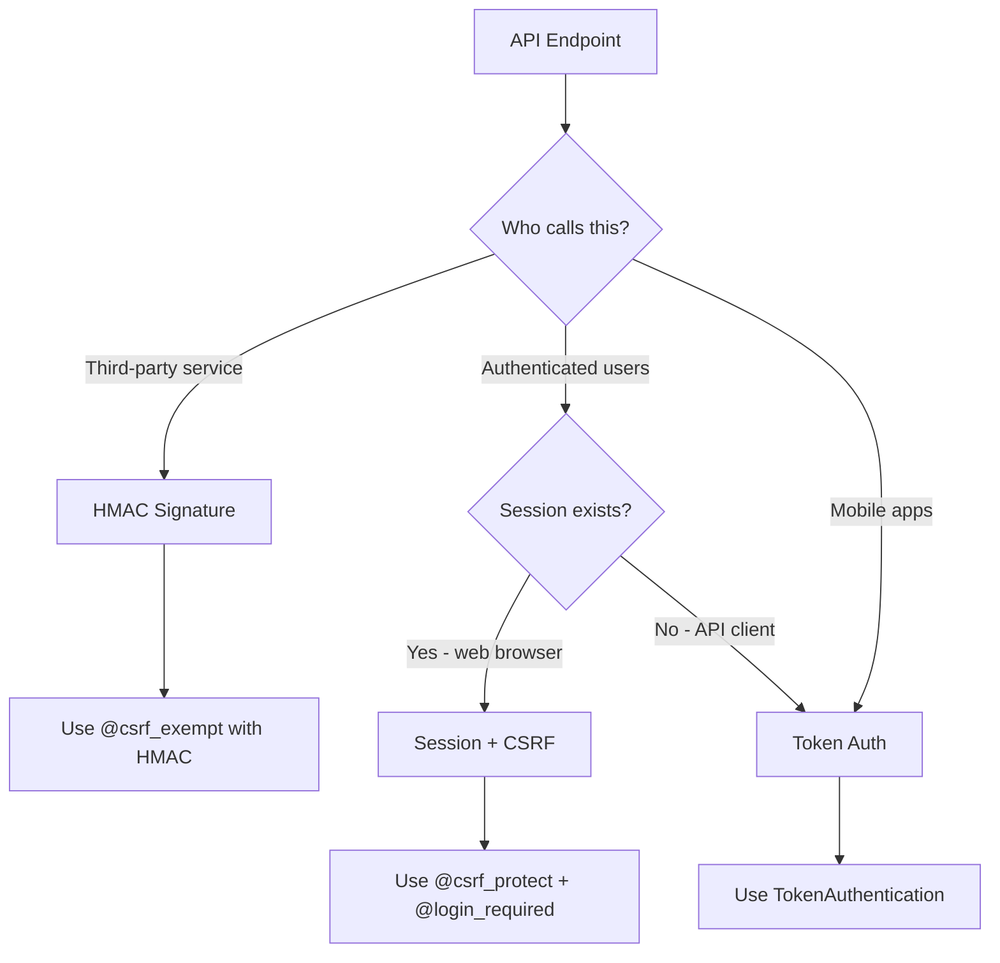

# Best Practices: API Authentication

**ID:** BP-SEC-001  
**Category:** Security Best Practices  
**Difficulty:** Intermediate  
**Last Updated:** November 6, 2025

---

## Overview

Proper API authentication prevents unauthorized access to your endpoints and protects sensitive data.

**Key Principle:** Never use `@csrf_exempt` without alternative authentication.

---

## ❌ Anti-Patterns (FORBIDDEN)

### 1. CSRF Exempt Without Protection

```python
from django.views.decorators.csrf import csrf_exempt

@csrf_exempt  # ⚠️ SECURITY VULNERABILITY
def api_endpoint(request):
    # No authentication at all
    data = request.POST.get('sensitive_data')
    return JsonResponse({'status': 'ok'})
```

**Why This Is Dangerous:**
- Open to CSRF attacks
- No user authentication
- Allows unauthorized data modification

### 2. Token in GET Parameters

```python
# ❌ FORBIDDEN: Token exposed in URL
@api_view(['GET'])
def api_view(request):
    token = request.GET.get('token')  # Logged in access logs
    if token == settings.SECRET_TOKEN:  # Static token
        return Response(data)
```

**Problems:**
- Tokens visible in browser history
- Logged in server access logs
- No token rotation

---

## ✅ Required Patterns

### 1. Token Authentication (REST Framework)

```python
from rest_framework.decorators import api_view, permission_classes
from rest_framework.permissions import IsAuthenticated
from rest_framework.authentication import TokenAuthentication

@api_view(['POST'])
@permission_classes([IsAuthenticated])
def secure_api_endpoint(request):
    """
    Requires valid authentication token in Authorization header.
    
    Usage:
        curl -H "Authorization: Token abc123..." https://api.example.com/endpoint
    """
    user = request.user  # Guaranteed to be authenticated
    return Response({'status': 'success'})
```

**Benefits:**
- Token in HTTP header (not logged)
- Built-in token rotation
- Per-user tokens for auditing

### 2. HMAC Signature Authentication

```python
import hmac
import hashlib
from django.conf import settings
from django.http import JsonResponse
from django.views.decorators.csrf import csrf_exempt

@csrf_exempt  # Safe because HMAC provides authentication
def webhook_receiver(request):
    """
    Validates webhook requests using HMAC signature.
    
    Third-party services (Stripe, GitHub) send signature in header.
    """
    signature = request.headers.get('X-Webhook-Signature')
    payload = request.body
    
    # Compute expected signature
    expected = hmac.new(
        settings.WEBHOOK_SECRET.encode(),
        payload,
        hashlib.sha256
    ).hexdigest()
    
    # Constant-time comparison prevents timing attacks
    if not hmac.compare_digest(signature, expected):
        return JsonResponse({'error': 'Invalid signature'}, status=403)
    
    # Process webhook
    return JsonResponse({'status': 'ok'})
```

**When to Use:**
- Webhook receivers from third-party services
- Server-to-server communication
- No user session required

### 3. Session Authentication (Internal APIs)

```python
from django.views.decorators.csrf import csrf_protect
from django.contrib.auth.decorators import login_required

@csrf_protect  # ✅ CSRF protection enabled
@login_required  # ✅ User must be logged in
def internal_api(request):
    """
    Uses Django session authentication + CSRF protection.
    
    For AJAX calls from authenticated web pages.
    """
    return JsonResponse({
        'user': request.user.username,
        'data': get_user_specific_data(request.user)
    })
```

**JavaScript AJAX Setup:**

```javascript
// Get CSRF token from cookie
function getCookie(name) {
    const value = `; ${document.cookie}`;
    const parts = value.split(`; ${name}=`);
    if (parts.length === 2) return parts.pop().split(';').shift();
}

// Include CSRF token in all AJAX requests
fetch('/api/internal/endpoint', {
    method: 'POST',
    headers: {
        'Content-Type': 'application/json',
        'X-CSRFToken': getCookie('csrftoken')
    },
    body: JSON.stringify(data)
});
```

---

## Decision Tree: Choose Authentication Method



---

## Security Checklist

- [ ] **No `@csrf_exempt` without alternative authentication**
- [ ] **Tokens in Authorization header, not URL parameters**
- [ ] **Token rotation mechanism implemented**
- [ ] **Rate limiting enabled (see BP-SEC-003)**
- [ ] **Audit logging for authentication failures**
- [ ] **HTTPS enforced in production**
- [ ] **Token expiration configured (max 7 days)**
- [ ] **Failed authentication attempts tracked**

---

## Common Mistakes

### Mistake 1: Mixing Authentication Methods

```python
# ❌ WRONG: Inconsistent authentication
@csrf_exempt
@permission_classes([IsAuthenticated])  # Contradictory
def confused_endpoint(request):
    pass
```

**Fix:** Choose one authentication method per endpoint.

### Mistake 2: Testing Authentication Logic

```python
# ❌ WRONG: Authentication logic in view
def api_view(request):
    if request.headers.get('Authorization') == 'Bearer xyz':
        # Custom auth logic scattered everywhere
        pass
```

**Fix:** Use Django REST Framework authentication classes.

---

## Testing Authentication

```python
from rest_framework.test import APITestCase
from rest_framework.authtoken.models import Token
from apps.peoples.models import People

class APIAuthenticationTests(APITestCase):
    """Test API authentication enforcement."""
    
    def setUp(self):
        self.user = People.objects.create_user(
            username='testuser',
            password='testpass'
        )
        self.token = Token.objects.create(user=self.user)
    
    def test_requires_authentication(self):
        """Endpoint rejects unauthenticated requests."""
        response = self.client.post('/api/secure-endpoint/')
        self.assertEqual(response.status_code, 401)
    
    def test_accepts_valid_token(self):
        """Endpoint accepts valid token."""
        self.client.credentials(
            HTTP_AUTHORIZATION=f'Token {self.token.key}'
        )
        response = self.client.post('/api/secure-endpoint/')
        self.assertEqual(response.status_code, 200)
    
    def test_rejects_invalid_token(self):
        """Endpoint rejects invalid token."""
        self.client.credentials(
            HTTP_AUTHORIZATION='Token invalid-token-123'
        )
        response = self.client.post('/api/secure-endpoint/')
        self.assertEqual(response.status_code, 401)
```

---

## References

- **[.claude/rules.md - Rule 2](../../.claude/rules.md#rule-2-mandatory-csrf-protection)** - Mandatory CSRF protection
- **[Security Audit Report](../../SECURITY_AUDIT_PHASE1_COMPLETE.md)** - Authentication vulnerabilities found
- **[ADR-005: Exception Handling](../architecture/adr/005-exception-handling-standards.md)** - Handling auth errors
- **[BP-SEC-003: Rate Limiting](BP-SEC-003-Rate-Limiting.md)** - Prevent brute force attacks

---

## Related Articles

- [BP-SEC-002: Authorization & IDOR Prevention](BP-SEC-002-Authorization-IDOR.md)
- [BP-SEC-003: Rate Limiting](BP-SEC-003-Rate-Limiting.md)
- [BP-TEST-001: Security Testing](BP-TEST-001-Security-Testing.md)

---

**Questions?** Submit a Help Desk ticket with tag `best-practices-auth`
