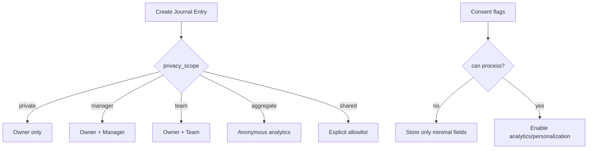
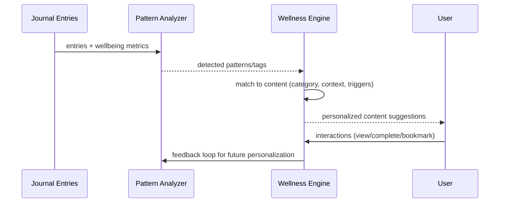

# Journal & Wellness System

_Preamble: A complete journaling system with privacy controls, wellbeing metrics, sync, and evidence‑based wellness education with personalization._

## Journal
- Models: `apps/journal/models.py`
  - `JournalEntry`: privacy scope, consent, wellbeing fields (mood/stress/energy), positive psychology fields, tags, sync/versioning, tenant isolation
  - `JournalMediaAttachment`: media with hero selection and sync metadata
  - `JournalPrivacySettings`: default scopes and granular consents
- GraphQL: `apps/journal/graphql_schema.py` with privacy‑aware fields and analytics types

## Wellness
- Models: `apps/wellness/models.py`
  - `WellnessContent`: evidence level, delivery contexts, tags, triggers, sources/citations
  - Progress/Interaction: personalization, gamification, adherence tracking

## Extending
- Add content with evidence and triggers; respect tenant rules and delivery frequency limits.
- Implement new analytics via resolvers and ML helpers under `apps/journal/ml/`.

## Privacy & Consent Flows


## Personalization Pipeline


## GraphQL Examples
```graphql
query MyWellbeingEntries($first:Int!,$after:String){
  allJournalEntries(first:$first, after:$after, filters:{isWellbeing:true}){
    edges{ node{ id title moodRating stressLevel privacyDisplay createdAt } }
    pageInfo{ hasNextPage endCursor }
  }
}
```

```graphql
mutation CreateEntry($input: JournalEntryInput!){
  createJournalEntry(input:$input){
    ok
    entry{ id title privacyDisplay }
    errors
  }
}
```

## Ops Notes
- Retention: use `JournalPrivacySettings.data_retention_days`; add periodic cleanup.
- Sync conflicts: resolve via `mobile_id` + `version` (last‑write‑wins or merge policies).
- Evidence verification: track `evidence_level`, `last_verified_date` on `WellnessContent` and establish a re‑verification cadence.

