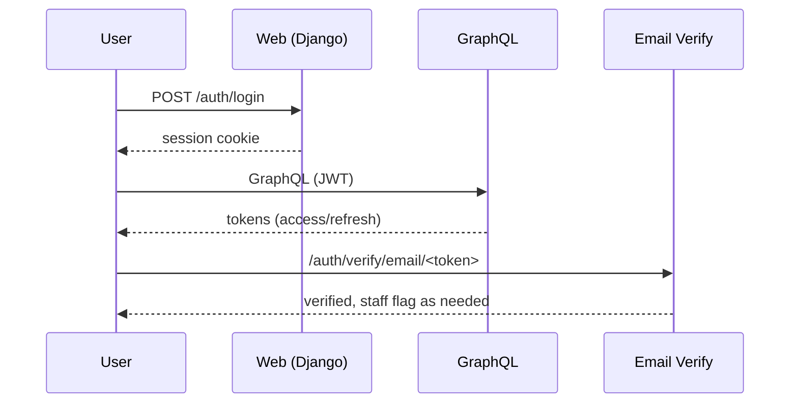

# People & Authentication

_Preamble: The People domain provides the custom user model and directory foundations. Learn how users are modeled, authenticated, grouped, and extended safely._

## Model
- User: `apps/peoples/models.py:People` extends `AbstractBaseUser`, `PermissionsMixin`, `TenantAwareModel`, `BaseModel`.
- Secure fields via `SecureString` custom field; media paths via `upload_peopleimg`.
- Groups/Capabilities: managed in `apps/peoples/` (managers, models, views).

## Auth
- GraphQL JWT middleware active (`GRAPHENE`, `GRAPHQL_JWT` in `intelliwiz_config/settings.py`).
- Classic session auth available for web views (SignIn/SignOut in `apps/peoples/views.py`).
- Routes wired in `intelliwiz_config/urls_optimized.py` under `/auth/*` and consolidated People URLs in `apps/core/urls_people.py`.

## Extending
- Add profile fields to `People`; ensure migrations and admin integration.
- Respect tenant boundaries using `TenantAwareModel`.
- For APIs, expose via serializers (`apps/peoples/serializers.py`) or GraphQL types and dataloaders.

## Tips
- Keep `AUTH_USER_MODEL` stable; changes require careful migrations.
- Use `select_related/prefetch_related` in list views to avoid N+1.

## Auth Flows


## Permissions & Capabilities
- Map groups to capability sets (menus, features) using People group membership.
- Example capability check:
```python
def can_access_reports(user: People) -> bool:
    return user.groups.filter(name__in=["Managers","Analysts"]).exists()
```

## SecureString Usage
```python
from apps.peoples.models import SecureString

class SecretNote(models.Model):
    note = SecureString(max_length=2048)

# Assigning encrypts transparently; reading decrypts (prefixed ENC_V1:)
obj = SecretNote.objects.create(note="sensitive")
print(obj.note)  # decrypted value
```

## Ops Notes
- Lockouts/rate limits: enforce at login and sensitive endpoints; prefer IP+user counters.
- Staff vs superuser: restrict superuser usage; prefer staff with granular capabilities.
- Password resets/rotation: use email verification and forced reset policies; track last change.

