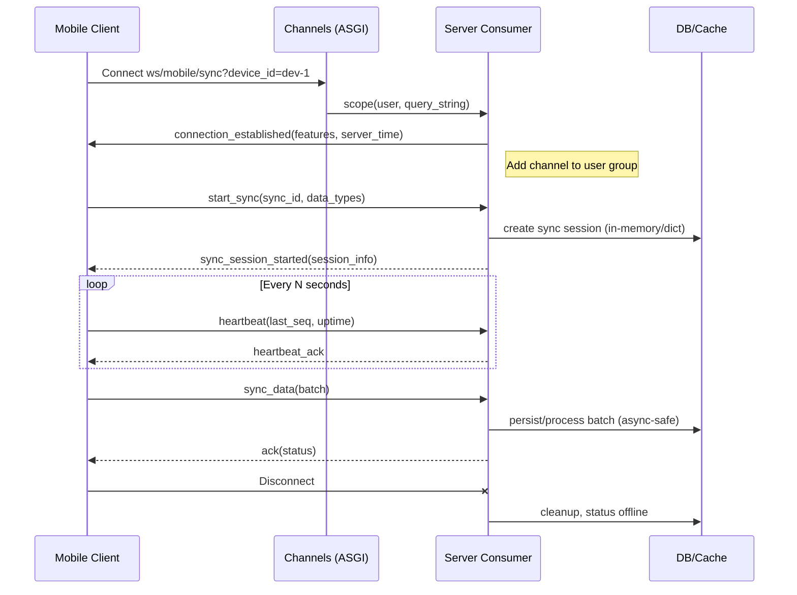

# Real-Time & Mobile Sync

_Preamble: WebSockets power mobile synchronization and live dashboards. Learn the routing, consumers, and safe extension patterns._

## Routing
- ASGI: `intelliwiz_config/asgi.py`
- Mobile WS routes: `apps/api/mobile_routing.py`
  - `ws/mobile/sync/`, `ws/mobile/system/`, device/user scoped patterns
- Dashboard WS routes: `apps/streamlab/consumers.py` groups

## Consumers
- Mobile: `apps/api/mobile_consumers.py:MobileSyncConsumer`
  - Auth on connect; device binding; sync sessions; heartbeat; message handlers (`start_sync`, `sync_data`, `resolve_conflict`, etc.)
- Dashboard: `apps/streamlab/consumers.py`
  - `StreamMetricsConsumer` and `AnomalyAlertsConsumer` for staff users

## Patterns
- Keep event loop snappy; move DB I/O under `@database_sync_to_async`.
- Use channel groups for broadcast updates.
- Log correlation IDs and timings for stream observability.

## Message Contracts (ws/mobile/sync)
- Envelope (JSON):
  - `type` string: e.g., `start_sync`, `sync_data`, `request_server_data`, `resolve_conflict`, `subscribe_events`, `heartbeat`, `device_status`
  - `sync_id` string (UUID for session-scoped messages)
  - `payload` object: message-specific fields
  - `ts` iso8601 timestamp (client time)

- Examples:
  - Start sync
    ```json
    {"type":"start_sync","sync_id":"ab12...","payload":{"data_types":["voice","behavioral"],"total_items":42}}
    ```
  - Sync data batch
    ```json
    {"type":"sync_data","sync_id":"ab12...","payload":{"batch":[{"kind":"voice","duration_ms":1234,"confidence":0.93,"device_id":"dev-1"}]}}
    ```
  - Heartbeat
    ```json
    {"type":"heartbeat","payload":{"last_seq":120,"uptime_s":3600}}
    ```

- Server responses (success):
  - `type`: `connection_established`, `sync_session_started`, `ack`, `server_data`, `events_subscribed`, `heartbeat_ack`
  - Always include server `server_time` and, when applicable, `features`/`session_info`.

- Errors:
  - JSON envelope: `{ "type":"error", "code":"UNKNOWN_MESSAGE_TYPE", "message":"...", "correlation_id":"..." }`
  - Common codes: `UNAUTHORIZED`, `MISSING_DEVICE_ID`, `MISSING_SYNC_ID`, `HANDLER_ERROR`, `MESSAGE_PROCESSING_ERROR`, `JSON_DECODE_ERROR`

## Lifecycle
1) Connect → 2) Auth (scoped user) → 3) Device bind via query param `device_id` → 4) `connection_established` ack → 5) Optional `subscribe_events` → 6) `start_sync` → 7) `sync_data` batches → 8) periodic `heartbeat` every 15–30s → 9) graceful disconnect or idle timeout.

## Rate Limiting & Backpressure
- Inbound limits:
  - Cap batch size (e.g., 100 items) in `sync_data`.
  - Reject bursty senders with `429` equivalent error payloads; advise exponential backoff.
  - Maintain per-connection and per-user counters (redis) if needed.
- Outbound limits:
  - Use channel-layer groups with periodic fan-out; avoid per-client hot loops.
  - Prefer push of deltas, not full state.
- Heartbeats & idle:
  - Heartbeat interval: 15–30s; disconnect if no heartbeat within 2× interval.

## Production Deployment Notes
- Process model: Daphne/Uvicorn with multiple ASGI workers; CPU-bound work offloaded.
- Redis sizing: separate DB for channels (db2), capacity per `CHANNEL_LAYERS` config.
- Health probes: add `/alive` (liveness) and `/ready` (readiness) HTTP checks.
- TLS termination: ensure sticky sessions not required; auth is token/cookie based.

## Example Pattern
```python
# Inside consumer
async def receive(self, text_data):
    start = time.time(); mcid = str(uuid.uuid4())
    try:
        msg = json.loads(text_data)
        await self._handle_message(msg, mcid)
    except json.JSONDecodeError:
        await self.send(json.dumps({"type":"error","code":"JSON_DECODE_ERROR"}))
    finally:
        logger.info("ws msg", extra={"corr": self.correlation_id, "mcid": mcid, "ms": round((time.time()-start)*1000,2)})
```

## Sequence Diagram (WebSocket Lifecycle)


