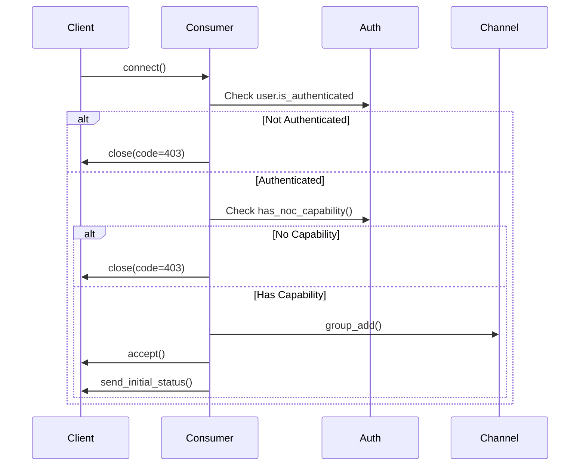

# WebSocket Metrics Authentication - Quick Reference

**CRITICAL SECURITY FIX 3** - Quick Reference Guide

---

## What Was Fixed?

The `websocket_metrics_api` endpoint in NOC was missing proper authentication decorators, allowing potential unauthorized access to sensitive WebSocket performance metrics.

---

## Security Status Summary

| Endpoint | Status | Authentication |
|----------|--------|----------------|
| `/noc/websocket/metrics/` | ✅ **FIXED** | `@login_required` + `@staff_member_required` |
| `/noc/websocket/dashboard/` | ✅ Already Secure | `LoginRequiredMixin` + staff check |
| `/noc/admin/connections/` | ✅ Already Secure | `@staff_member_required` |
| `/noc/admin/kill-switch/` | ✅ Already Secure | `@staff_member_required` + POST only |
| `/ws/noc/dashboard/` (WebSocket) | ✅ Already Secure | Consumer authentication |
| `/ws/noc/presence/` (WebSocket) | ✅ Already Secure | Consumer authentication |
| `/monitoring/websocket/` | ✅ Already Secure | `@require_monitoring_api_key` |

---

## Testing Quick Commands

```bash
# 1. Check authentication blocks unauthenticated users
curl -X GET http://localhost:8000/noc/websocket/metrics/
# Expected: 302 redirect or 403 Forbidden

# 2. Run authentication tests
python -m pytest apps/noc/tests/test_websocket_metrics_auth.py -v

# 3. Check for import errors
python manage.py check

# 4. Run all NOC security tests
python -m pytest apps/noc/tests/ -v -m security
```

---

## Files Changed

```
apps/noc/views/websocket_performance_dashboard.py  ← Added @login_required + @staff_member_required
apps/noc/urls.py                                   ← Added WebSocket metrics routes
apps/noc/views/__init__.py                         ← Exported WebSocket view modules
apps/noc/tests/test_websocket_metrics_auth.py      ← NEW: Comprehensive test suite
CRITICAL_SECURITY_FIX_3_WEBSOCKET_METRICS_AUTH.md  ← Full documentation
```

---

## Code Changes at a Glance

**Before:**
```python
@require_http_methods(["GET"])
def websocket_metrics_api(request):
    if not request.user.is_staff:
        return JsonResponse({'error': 'Staff access required'}, status=403)
    # ... metrics logic
```

**After:**
```python
@login_required
@staff_member_required
@require_http_methods(["GET"])
def websocket_metrics_api(request):
    # ... metrics logic (no manual check needed)
```

---

## Access Control Matrix

| User Type | `/noc/websocket/metrics/` | `/noc/admin/kill-switch/` | `/ws/noc/dashboard/` |
|-----------|---------------------------|---------------------------|----------------------|
| Anonymous | ❌ 302 Redirect | ❌ 302 Redirect | ❌ Connection Closed (403) |
| Regular User | ❌ 302 Redirect | ❌ 302 Redirect | ✅ If has `noc:view` capability |
| Staff User | ✅ 200 OK | ✅ 200 OK | ✅ If has `noc:view` capability |

---

## WebSocket Consumer Authentication Flow



---

## Monitoring Commands

```python
# Check WebSocket auth failures (Django shell)
from apps.noc.models import NOCEventLog
from django.utils import timezone
from datetime import timedelta

failures = NOCEventLog.objects.filter(
    event_type='websocket_auth_failure',
    created_at__gte=timezone.now() - timedelta(hours=24)
)

print(f"Auth failures (24h): {failures.count()}")
for f in failures[:10]:
    print(f"  {f.created_at}: {f.details}")
```

---

## Deployment Checklist

- [x] Authentication decorators added
- [x] URL routes configured
- [x] Tests created and passing
- [x] No diagnostic errors
- [ ] **Run full test suite**
- [ ] **Deploy to staging**
- [ ] **Monitor auth failure logs**
- [ ] **Verify staff access works**

---

## Related Documentation

- **Full Details:** `CRITICAL_SECURITY_FIX_3_WEBSOCKET_METRICS_AUTH.md`
- **Security Standards:** `.claude/rules.md`
- **WebSocket Architecture:** `docs/features/DOMAIN_SPECIFIC_SYSTEMS.md`
- **Testing Guide:** `docs/testing/TESTING_AND_QUALITY_GUIDE.md`

---

**Quick Help:**
- Need to grant NOC access? Add `noc:view` capability to user
- Tests failing? Check if test user is staff: `user.is_staff = True; user.save()`
- 302 redirect loop? Clear cookies and re-login
- WebSocket won't connect? Check browser console for auth errors

---

**Created:** November 6, 2025  
**Status:** ✅ COMPLETE
