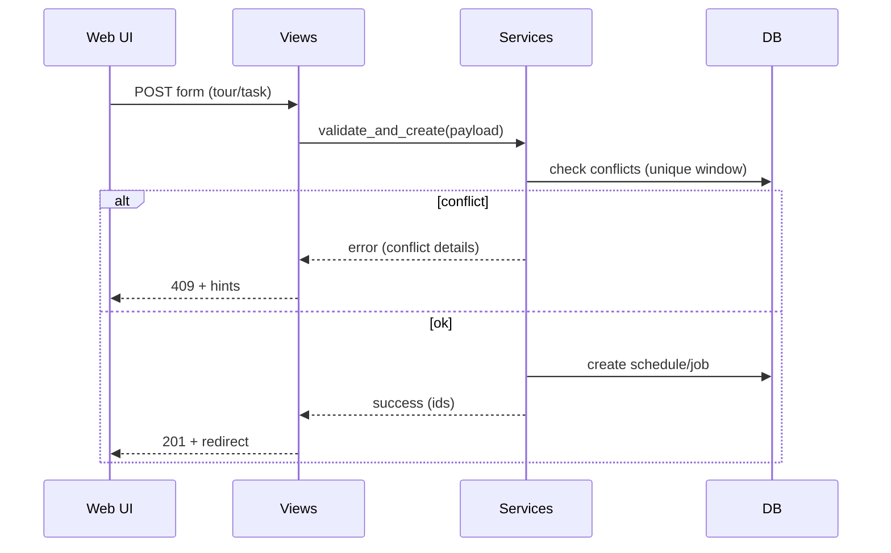
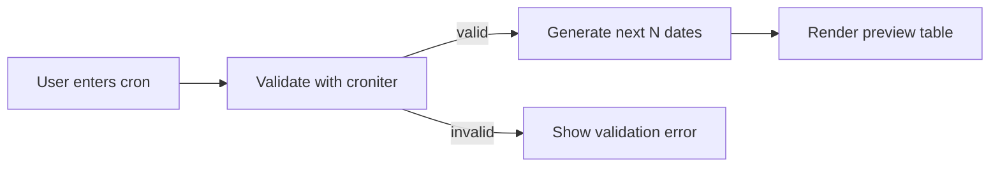

# Scheduler (schedhuler)

_Preamble: Legacy spelling aside, this app drives tour/task scheduling and previews. It’s view/service heavy; this chapter shows safe extension patterns._

## Structure
- App: `apps/schedhuler/` (do not rename without a broad migration plan)
- Views: `apps/schedhuler/views.py`
- Services: `apps/schedhuler/services.py`
- Forms/Filters/Utils: `apps/schedhuler/forms.py`, `apps/schedhuler/filters.py`, `apps/schedhuler/utils.py`

## Capabilities
- Internal/External tour creation (form jobs)
- Task creation and updates
- Schedule preview with cron validation (`croniter`)

## Extending
- Put business logic in `services.py` (TourJobService, TaskJobService, ScheduleService); keep views thin.
- Add tests under `apps/schedhuler/tests/`.
- Consider modularizing `views.py` into submodules as features grow (tours.py, tasks.py, preview.py).

## Flows & Diagrams

### Tour/Task Creation Flow


### Preview Generation


## Code Samples

### Using services from views
```python
# apps/schedhuler/views.py (excerpt)
from .services import ScheduleService

class SchedulePreviewView(View):
    def post(self, request):
        cron = request.POST.get("cron")
        tz = request.POST.get("tz", "UTC")
        try:
            dates = ScheduleService.preview(cron_expr=cron, count=20, tz=tz)
            return JsonResponse({"ok": True, "dates": [d.isoformat() for d in dates]})
        except ValueError as e:
            return JsonResponse({"ok": False, "error": str(e)}, status=400)
```

### Cron validation and preview
```python
# apps/schedhuler/services.py (excerpt)
from croniter import croniter
from datetime import datetime
import pytz

class ScheduleService:
    @staticmethod
    def preview(cron_expr: str, count: int = 10, tz: str = "UTC"):
        if not croniter.is_valid(cron_expr):
            raise ValueError("Invalid cron expression")
        tzinfo = pytz.timezone(tz)
        now = datetime.now(tzinfo)
        it = croniter(cron_expr, now)
        return [it.get_next(datetime) for _ in range(min(100, max(1, count)))]
```

### Idempotent create with basic locking
```python
from django.db import transaction

def create_job_safely(payload):
    key = (payload["asset_id"], payload["window_start"], payload["window_end"])  # example uniqueness
    with transaction.atomic():
        # Acquire a DB‑backed lock using SELECT ... FOR UPDATE on a guard row if needed
        # Lock table or guard row pattern omitted for brevity
        exists = Job.objects.select_for_update().filter(
            asset_id=key[0], window_start=key[1], window_end=key[2]
        ).exists()
        if exists:
            raise ValueError("Schedule conflict for this window")
        return Job.objects.create(**payload)
```

## Ops Notes
- Concurrency: use transactions and selective `select_for_update` for conflict detection.
- Idempotency: derive request idempotency keys (e.g., hash of natural keys) to avoid duplicate schedules.
- Boundaries: test DST transitions; cron expressions around midnight; end‑of‑month edge cases.
- Rollback strategy: keep create/update small and transactional; defer heavy post‑create work to async tasks.

## Checklist: New Schedule Type
- Endpoints: add create/update/preview routes.
- Forms/Serializers: validate business rules, cron constraints.
- Services: encapsulate core logic; add conflict detection.
- Tests: unit (services), integration (views), edge cases (DST, month‑ends).
- Docs: update this page with specifics; add examples.

