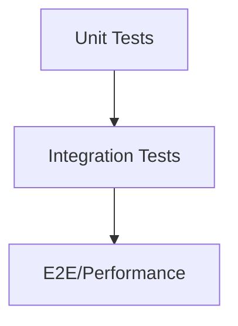

# Testing & CI

_Preamble: Robust unit, integration, and performance tests validate correctness and prevent regressions. Learn how to run, write, and extend tests._

## Structure
- Repo‑wide tests: `tests/` (API, integration, performance)
- App tests: e.g., `apps/streamlab/tests/`, `apps/onboarding_api/tests/`, etc.

## Running
- `scripts/run_tests_with_coverage.py` or `scripts/run_tests.sh`
- Performance analysis: `scripts/test_performance_optimizations.py`, `scripts/analyze_query_performance.py`

## GraphQL Examples
- `tests/api/integration/test_graphql.py` covers dataloaders, resolvers, and N+1 checks.

## CI
- GitHub workflows under `.github/workflows/` for code quality, performance regression, nightly soak, and mentor analysis.

## Writing Tests
- Use factories and fixtures; test services separately from views when possible.
- For GraphQL, assert query counts and that dataloaders batch correctly.

## Test Pyramid


## Query Counter Harness (GraphQL)
```python
@pytest.fixture
def query_counter(db):
    from django.test.utils import CaptureQueriesContext
    from django.db import connection
    class Ctx:
        def __enter__(self):
            self.ctx = CaptureQueriesContext(connection); self.ctx.__enter__(); return self
        def __exit__(self, *a): self.ctx.__exit__(*a)
        def __iter__(self): return iter(self.ctx)
        def __len__(self): return len(self.ctx)
    return Ctx
```

## Channels Consumer Test Sketch
```python
@pytest.mark.asyncio
async def test_ws_connect(authenticated_user, communicator):
    from apps.api.mobile_consumers import MobileSyncConsumer
    comm = communicator(MobileSyncConsumer.as_asgi(), 
        path='/ws/mobile/sync/?device_id=dev-1', user=authenticated_user)
    connected, _ = await comm.connect()
    assert connected
    await comm.disconnect()
```

## CI Budgets
- Enforce p95 response time ceilings in perf tests.
- Fail builds on N+1 regressions over thresholds.
- Gate on minimum coverage; quarantine flakes and fix promptly.

